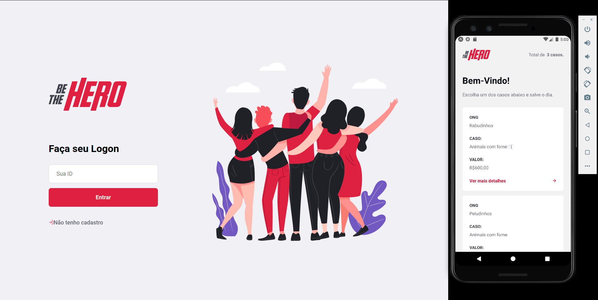
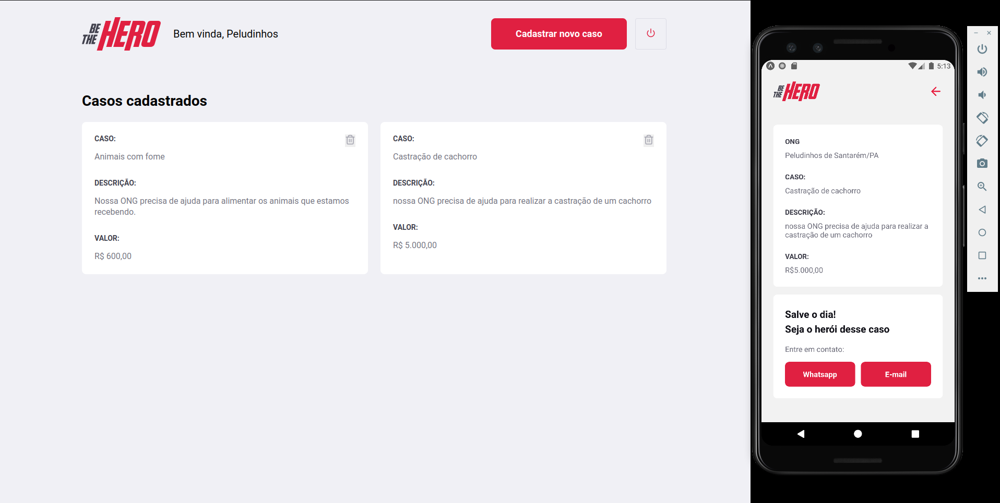
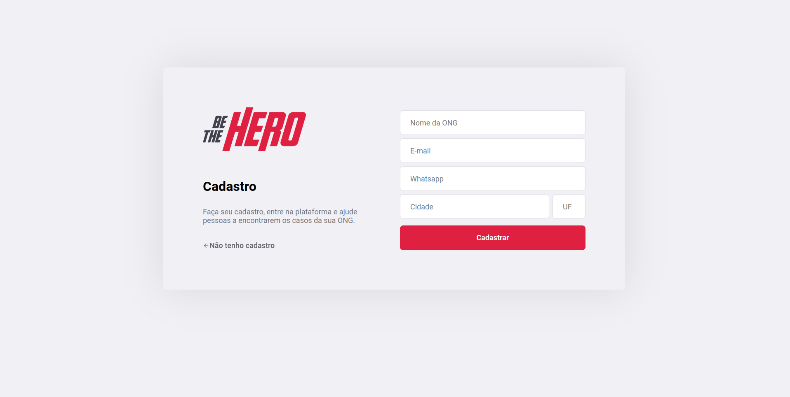
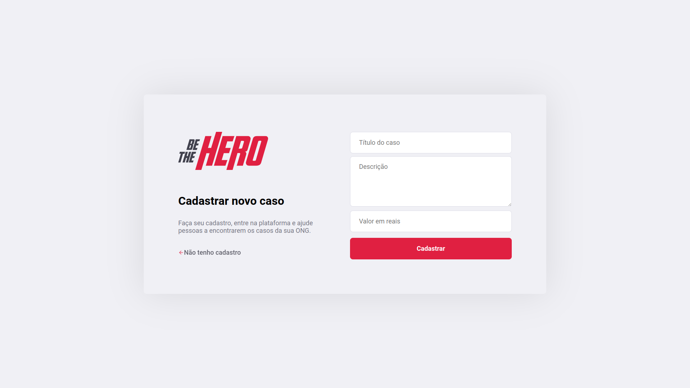

<div>
  <h1 align="center"> 
    
  </h1>
  <h2 align="center"> 
  RocketSeat - Semana OmniStack 11 🔥
  </h2>
  <h3 align="center"> 
  Application to connect NGOs to people who are willing to help
  </h3>

  <p align="center">
    <a href="https://rocketseat.com.br">
      
    </a>
    <a href="https://github.com/jorgeeder"> 
      
    </a>
    
    
    <a href="https://opensource.org/licenses/MIT">
      
    </a>
  </p>
</div>

## About The Project

During the 11th week of Rocketseat's OmniStack, the Be The Hero application was developed, which aims to help Non-Governmental Organizations - NGOs to find people who are willing to contribute with some value.


## Features

Web Application
 
- User can register NGOs
- NGOs can login to the web application
- NGOs can view the list of their registered cases
- NGOs can register cases
- NGOs can delete registered cases
- NGOs can log out of the application

Mobile Application

- List all registered cases
- Lists details of a case
- Button to contact by E-mail
- Button to contact by Whatsapp


## Technologies

-   **[Node.js](https://nodejs.org/)**
-   **[SQLite](https://www.sqlite.org/)**
-   **[React](https://reactjs.org/)**
-   **[Expo](https://expo.io/)**
-   **[React Native](https://reactnative.dev/)**


## Application in Use

See on  **[Youtube](https://www.youtube.com/watch?v=dFZhJ1uWTmE&list=PLUIvd9-i3UB-83d6xifzWlAuQalJl00cT&index=6)**

Application layout in  **[Figma](https://www.figma.com/file/2C2yvw7jsCOGmaNUDftX9n/Be-The-Hero---OmniStack-11?node-id=0%3A1)**






## Requirement

-   **[Node.js](https://nodejs.org/)**


## Running The Project

```bash
# You can use npm package manager or yarn to run the commands below

## Clone the repository
git clone https://github.com/jorgeeder/be-the-hero.git

## Access the project folder in the terminal
cd be-the-hero

## Go to the folder where you want to install the dependencies
cd backend # or: cd frontend / or: cd mobile

## To install dependencies in backend, frontend and mobile folders
npm install # or: yarn

## To use the web version enter the backend and frontend folders and run
npm start # or: yarn start
## Access in the browser http://localhost:3000

## To use the mobile version enter the backend and mobile folders and run
npm start # or: yarn start
## Access in the browser http://localhost:19002
## Read the QR Code on your cell phone and use the Expo app to run the mobile version on your smartphone, or use an Android/iOS emulator to run it on your computer.

# in case : Possible Unhandled Promise Rejection (id: 0):
# [AxiosError: Network Error]

## Access in the browser http://localhost:19002
## copy the address of the connection that is above the qrcode
## Go to mobile/src/services/api.js and change the BaseURL with the copied connection address
## example: baseURL: 'http://192.168.1.11:3333' changed to baseURL: 'http://192.168.10.80:3333'


```
## License

This project is under the MIT license. See the [LICENSE](/LICENSE) file for more details.


<div align="center">
  <p> Made with 💜 by <a href="https://github.com/jorgeeder">Jorge Eder</a> </p>
  <p>
    <a href="https://www.linkedin.com/in/jorgeeder/">
      
    </a>
    <a href = "mailto:jorgeeder.dev@gmail.com">
      
    </a>
  </p>
</div>